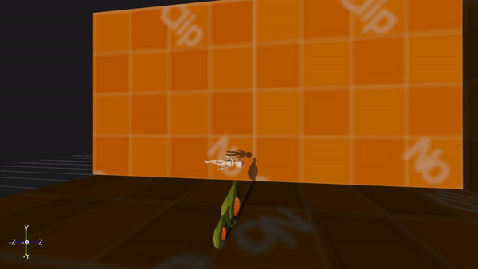
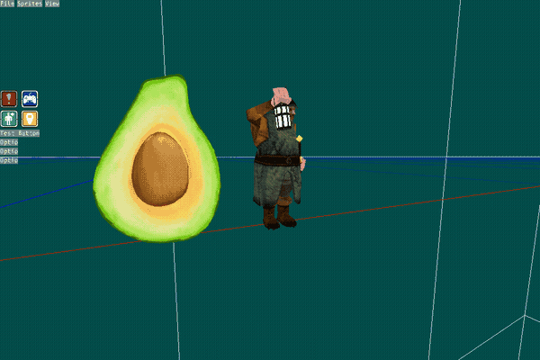

# README

---

## Forest Engine

<!--  -->

> Forest Engine is a C++ / OpenGL Game Engine made from scratch with the only purpose of improving my gamedev and programming skills.

Forest Engine has been the latest iteration of my Game Engine (previously [DruidEngine](https://github.com/adrianensis/DruidEngine) and before that it was [ThiefEngine](https://github.com/adrianensis/ThiefEngine)).

After about 10 years of learning I've decided to stop working on it and release the code on GitHub in case it's helpful or interesting to other people.

The state I leave the engine is: stable but not usable, there are still known bugs and pending tasks, so don't take this code as a reliable source of knowledge.

## Build

### Linux

* First, **download and install dependencies**: `./scripts/dependencies.sh`
* Build project: `python3 ./scripts/build.py -[ruixlch]`
  * -h Show help.
  * -r Compile Release, **Debug by default**.
  * -u Compile Unit Tests suite. (NEEDED BY `test.sh`)
  * -i Compile Integration Tests suite. (NEEDED BY `test.sh`)
  * -x Compile Tools.
  * -l Enable Logs.
  * -p Enable Profiler.
  * -c Clean the project.
* Run unitary tests (optional): `./scripts/test.sh`
* Generate documentation (optional): `./scripts/doc.sh`

Example: build debug `tool_Editor` with this command `python3 scripts/build.py -lp --tool=Editor --gpuDbg`

### Windows

> Not available yet.

---

### Directories

* **code:** Source and Headers.
* **config:** Engine and scenes config files.
* **scripts:** Contains scripts described above.
* **compiledLibs:** Contains the libForest.a. Generated by `scripts/build.py`.
* **binaries:** Generated by `scripts/test.sh.`. Contains the test executable files (both unitary and integration).
* **test:** Set of tests. Unitary and Integration.
* **tools:** Set of tools.
* **dependencies:** Generated by `scripts/dependencies.sh.` Contains third party libraries.
* **build:** Generated by `scripts/build.py`.

---

### Unitary Tests

Run unitary tests with `./scripts/test.sh`. Result are stored in **binaries/output**.
This command will print the results in terminal.

### Integration Tests

Run integration test by executing `./binaries/test_integration`. Result is stored in **log.txt**.

---

## Devlogs

Here in my blog you can find all the devlogs of my Game Engine, from 2D initial stages to the latest 3D version: [Devlogs](https://adrianensis.github.io/blog/categories/#devlogs)

---

## Characteristic

- OpenGL 4.x
- Batching
- Shaders
- Support for Texture Atlases
- Animation using Spritesheet
- Simple UI
- Scene management
- Perspective / orthographic camera
- Stencil
- Math module
- Simple scripting
- Loading 3D models with GLTF
- Skeletal Meshes
- Skeletal Animation
- GPU Skinning
- PBR Shading
- Directional Light
- Shadow Mapping
-

---

## Showcase

|  |  |   |
| ------ | ------ |
|      |      |
|      |      |
|      |      |
|      |      |
|      |      |
